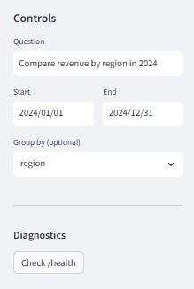
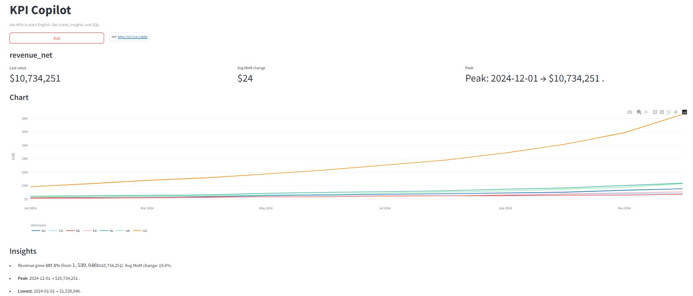

# 🧠 InsightMiner: LLM-Powered KPI Copilot

Natural language to SQL analytics engine powered by FastAPI, Streamlit, and GPT-based reasoning

## 🧩 Problem Statement

In most organizations, accessing business insights requires writing SQL queries or relying on data analysts. This slows down decision-making for non-technical stakeholders.

InsightMiner solves this problem by allowing users to ask questions in plain English. Ex. "Compare revenue by region in 2024" and automatically generating the right SQL query to fetch, visualize, and narrate the result.

It combines:
- LLM reasoning (GPT-4/4o) for understanding user intent and translating it to SQL
- A safety validator to ensure SQL queries are secure
- A deterministic fallback planner for structured KPIs (when LLMs fail)
- A lightweight analytics UI for real-time charting and insights

## ⚙️ Tech Stack

| Layer | Technology |
|-------|------------|
| Backend | FastAPI |
| LLM Planning | OpenAI GPT-4o |
| Database Layer | SQLite |
| Data Validation | Pydantic + SQL safety validator |
| Frontend | Streamlit |
| Visualization | Altair / Plotly |
| Orchestration | uvicorn + async FastAPI |

## 🎯 Output Screenshots

 


## 🖥️ Installation & Setup

### 🔧 Prerequisites

- Python 3.10+
- OpenAI API key (if you want to enable LLM mode)

### 🪜 Steps

#### 1️⃣ Clone the repository
```bash
git clone https://github.com/Sahithiv25/InsightMiner.git
cd InsightMiner

2️⃣ Create and activate venv
python -m venv .venv
.\.venv\Scripts\activate     # Windows
# or
source .venv/bin/activate    # macOS/Linux

#### 3️⃣ Install Dependencies
pip install -r requirements.txt

#### 4️⃣ Set environment variables
Create a .env file in the root directory with:
OPENAI_API_KEY=your_openai_api_key_here
LLM_MODEL=gpt-4o-mini

#### 5️⃣ Start the backend (FastAPI)
uvicorn app.main:app --host 127.0.0.1 --port 8080

Test it:
curl -X POST http://127.0.0.1:8080/ask-llm -H "Content-Type: application/json" -d "{\"question\":\"Compare revenue by region in 2024\",\"start\":\"2024-01-01\",\"end\":\"2024-12-31\"}"

#### 6️⃣ Start the frontend (Streamlit)
cd frontend
streamlit run streamlit_app.py
App will be available at:
👉 http://localhost:8501


